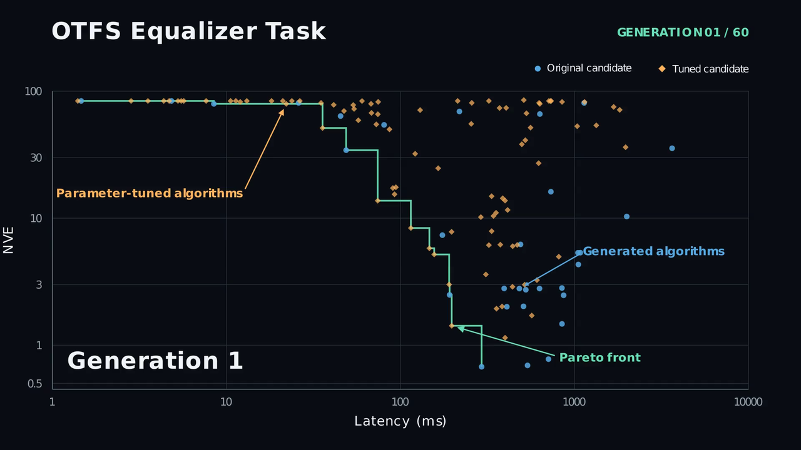
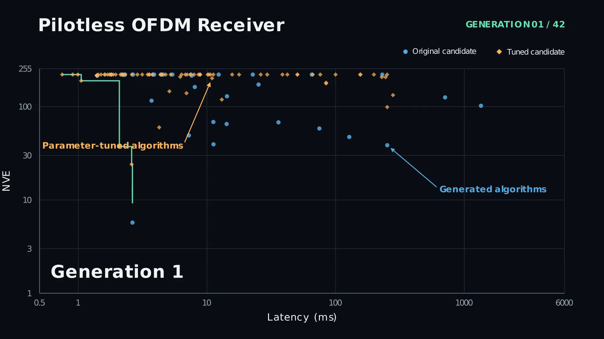

# The AI Telco Engineer（AI 电信工程师）

The AI Telco Engineer（AITE）是一个智能体框架，通过部署一群并行的大语言模型（LLM）工作节点，为用户自定义任务（例如信道估计器或链路自适应算法设计）自主设计并优化无线通信算法。每个工作节点由一个 LLM 驱动，并运行在隔离的容器化环境中。工作节点可使用一套工具包，包括文件编辑能力、Sionna 文档，以及可对算法性能给出反馈的任务专用评估工具。

AITE 实现了一种以想法驱动的多目标优化循环。编排器 LLM 为任务提出 `N` 种不同的算法思路（ideas）。规模为 `M` 的工作节点群体被分配到这些思路上，每个工作节点在各自隔离的工作区中实现并改进所分配的思路。每个解会在两个目标上被评估：**任务专用指标**与**复杂度度量**（例如浮点运算次数（FLOPs）、参数量或推理时间）。每次工作节点运行结束后，多目标超参数调优（通过 [Optuna](https://optuna.org/)）会为每个工作区生成一组帕累托最优配置。随后，跨所有工作区的全局二维帕累托前沿会驱动后续代际的想法生成，目标是不断将前沿向外推进。

本仓库对应论文 [“Autonomous Discovery of Wireless Communications Algorithms”](https://arxiv.org/pdf/2607.17762)，并包含文中研究的两个示例任务：正交时频空（OTFS）系统的均衡器，以及使用自定义星座、且无导频工作的正交频分复用（OFDM）系统接收机。

## 环境配置

工作节点运行在 Docker 容器中，因此需要可用的 [Docker](https://docs.docker.com/get-docker/) 安装；若任务需要 GPU 加速，还需安装 [NVIDIA Container Toolkit](https://docs.nvidia.com/datacenter/cloud-native/container-toolkit/latest/install-guide.html)。当没有 NVIDIA 运行时可用时，AITE 会回退到 CPU。使用以下命令安装 Python 依赖：

```bash
pip install -r requirements.txt
```

## 内置任务

**任务（task）** 是一个自包含文件夹，提供 AITE 解决给定问题所需的全部内容。AITE 在 `tasks/` 下附带了下表中的两个示例任务。也可以为其他无线通信问题[创建自定义任务](#创建新任务)。

| 任务 | 指标 | 优化方向 | 复杂度 | 描述 |
|------|------|----------|--------|------|
| `pilotless` | 归一化验证误差（NVE） | 越小越好 | 每次调用运行时 | 无导频 OFDM 接收机 |
| `otfs_detector` | 归一化验证误差（NVE） | 越小越好 | 每次调用运行时 | OTFS 均衡器 |

每个任务文件夹中包含可复现论文结果的 notebook：OTFS 均衡器见 [OTFS.ipynb](tasks/otfs_detector/OTFS.ipynb)，无导频接收机见 [Pilotless.ipynb](tasks/pilotless/Pilotless.ipynb)。对于 `pilotless` 任务，神经接收机基线的预训练权重可在[此处](https://drive.google.com/file/d/1yWbJ3Lk-efzLhDkqO5CSOnWW40Nhh6Wr/view?usp=sharing)获取。

点击下方预览可观看帕累托前沿演化过程的演示视频。

<p align="center">
  <a href="https://drive.google.com/file/d/1l4oopoCr3SqdnsfGp82c7wdCBhAu-en0/view?usp=sharing"></a>
  <a href="https://drive.google.com/file/d/1YybKsoVVWY5oBCSM5JtYakzLpcOQjsZV/view?usp=sharing"></a>
</p>

运行这些任务前，需要先安装其依赖：

```bash
pip install -r requirements-tasks.txt
```

**内置任务不能开箱即用。** 必须先在每个任务的 `config.json` 中填写所用模型的 **模型名称** 与 API **base URL**。这些值取决于模型的访问方式（例如远程端点或本地部署）。

需要在每个任务的 `config.json` 中填写的字段包括：
* 编排器 LLM：`manager_llm` 下的 `model` 与 `base_url`。我们使用的是 GPT-5.5，推理强度为 “high”。
* 工作节点 LLM：`agent_llm` 下的 `model` 与 `base_url`。我们使用的是 GPT-5.5，推理强度为 “medium”。

启用 [Sionna 文档](#sionna-文档) 搜索工具需要设置 embedding 与 reranker 端点。该工具首次运行时会索引 Sionna 教程与 API 文档，索引过程也依赖 LLM 做摘要。对应字段为：
* Embedding 模型：`tools_config.sionna_doc_config` 下的 `embedding_model` 与 `embedding_base_url`。我们使用的是 [nomic-embed-text-v1.5](https://huggingface.co/nomic-ai/nomic-embed-text-v1.5)。
* Reranker 模型：`tools_config.sionna_doc_config` 下的 `reranker_model` 与 `reranker_base_url`。我们使用的是 [ms-marco-MiniLM-L6-v2](https://huggingface.co/cross-encoder/ms-marco-MiniLM-L6-v2)。
* 摘要 LLM：`tools_config.sionna_doc_config.summarize_llm` 下的 `model` 与 `base_url`。我们使用的是 GPT-5.5，推理强度为 “low”。

## 启动任务

若访问所配置的 LLM 需要 API 密钥，请将其设置为环境变量：

```bash
export MODEL_API_KEY=<your-api-key>
```

启动任务使用：

```bash
python launch.py <task_folder>
```

例如，启动[内置任务](#内置任务)：

```bash
# OTFS 均衡器设计
python launch.py tasks/otfs_detector

# 无导频接收机
python launch.py tasks/pilotless
```

## 排行榜（Leaderboard）

**排行榜** 是搜索过程的实时记录：它列出工作节点产出的全部算法、其评估结果（成功或失败）、任务指标以及复杂度度量。Web 查看器会以二维散点图展示所有解（指标 vs 复杂度），并叠加帕累托前沿。

任务运行中（或运行结束后），可在 Web UI 中查看排行榜。在仓库根目录执行：

```bash
./scripts/leaderboard/serve.py --workspace path/to/workspaces
```

然后在浏览器中打开 **http://localhost:8000**。

更多选项（例如 `--port`）可使用 `./scripts/leaderboard/serve.py --help` 查看。

## 停止与恢复

按下 **Ctrl+C** 可优雅停止工作节点。排行榜会在每个候选完成后保存，因此进度会被保留。
在同一任务、同一工作区上重新运行 AITE，会从断点恢复优化过程。

## 创建新任务

新任务是 `tasks/` 下的一个子文件夹，需包含以下内容：

- **必需：**
  - `config.json` — 任务配置
  - `prompt.md` — 自然语言任务描述
  - `eval_tool.py` — 定义 `EvalTool` 类
  - `eval/eval.py` — 计算指标与复杂度的评估脚本
  - `docker/` — 包含工作节点容器 Dockerfile 的文件夹
- **可选：**
  - `eval/` 中的其他文件（数据集、辅助模块、基线），将被复制到工作区
  - `tool_factory.py` — 用于额外工具（例如 Sionna 文档搜索）

### 1. 创建任务文件夹

```bash
mkdir -p tasks/my_task/eval
mkdir -p tasks/my_task/docker
```

### 2. 创建 Docker 容器

在 `tasks/my_task/docker/` 中的 Dockerfile（例如 `tasks/my_task/docker/dockerfile_agent_container`）声明该任务的依赖。框架会在首次需要时根据 `config.json` 中的 `workspace.container.dockerfile_path` 自动构建镜像。

该镜像用于在隔离工作区中运行工作节点。工作节点可在容器内通过 PyPI 安装额外软件包。

镜像标签必须与 `config.json` 中的 `workspace.container.docker_image` 一致。若将 `workspace.container.dockerfile_path` 设为 `null`，则改用预构建镜像或公共镜像，例如 `python:3.12-slim`。

### 3. 创建必需文件

**`config.json`** — 任务配置。推荐从现有任务的文件复制后修改。示例：

```json
{
    "agent_llm": {
        "model": "<model-name>",
        "base_url": "<api-base-url>",
        "temperature": 0.7,
        "top_p": 0.95
    },
    "manager_llm": {
        "model": "<model-name>",
        "base_url": "<api-base-url>",
        "temperature": 0.0,
        "top_p": 0.95
    },
    "workspace": {
        "container": {
            "docker_image": "agent_my_task",
            "dockerfile_path": "docker/dockerfile_agent_container",
            "memory_limit": "16g",
            "pids_limit": 2048,
            "use_gpu": true
        }
    },
    "tools_config": {
        "eval_timeout": 120
    },
    "num_workers": 10,
    "num_gpus": 1,
    "higher_is_better": false,
    "population_size": 20,
    "num_ideas": 5,
    "num_generations": 5,
    "timeout": 900,
    "task_submit_delay": 30.0,
    "prompt_path": "prompt.md",
    "enable_prompt_refinement": false,
    "result_processing_concurrency": -1
}
```

| 参数 | 说明 |
|------|------|
| `agent_llm.model` | 工作节点使用的 LLM 模型 |
| `agent_llm.base_url` | 工作节点 LLM 的 OpenAI 兼容 API（应用程序接口）base URL。应包含 `/v1/`，但不包含 `/chat/completions`。 |
| `agent_llm.temperature` | 工作节点的采样温度 |
| `agent_llm.top_p` | 工作节点的 nucleus sampling top-p |
| `agent_llm.model_kwargs` | 可选的额外模型参数（例如 `{"reasoning_effort": "high"}`） |
| `manager_llm.model` | 编排器使用的 LLM 模型（用于想法与摘要） |
| `manager_llm.base_url` | 编排器 LLM 的 OpenAI 兼容 API base URL。应包含 `/v1/`，但不包含 `/chat/completions`。 |
| `manager_llm.temperature` | 编排器的采样温度 |
| `manager_llm.top_p` | 编排器的 nucleus sampling top-p |
| `manager_llm.model_kwargs` | 编排器可选的额外模型参数 |
| `workspace.base_path` | 工作节点工作区目录，相对于任务文件夹（默认：`"workspaces"`） |
| `workspace.container.docker_image` | 工作节点容器的 Docker 镜像名 |
| `workspace.container.dockerfile_path` | Dockerfile 路径，相对于任务文件夹。若镜像尚不存在，框架会自动构建。设为 `null` 可使用预构建或公共镜像（例如 `python:3.12-slim`）。 |
| `workspace.container.memory_limit` | 每个容器的内存限制（默认：`"16g"`） |
| `workspace.container.pids_limit` | 每个容器的最大进程数（默认：`2048`） |
| `workspace.container.use_gpu` | 是否在容器中启用图形处理单元（GPU）访问（默认：`true`）；若 NVIDIA 运行时不可用则回退到 CPU |
| `workspace.container.workspace_mount_point` | 容器内挂载工作区的路径（默认：`"/workspace"`） |
| `tools_config` | 传给 `ToolFactory` 与 `EvalTool` 的配置 |
| `tools_config.eval_timeout` | 每次评估运行的超时时间（秒，默认：`120`） |
| `num_workers` | 并行工作节点数量 |
| `num_gpus` | 本次运行可用的 GPU 数量（默认：`1`） |
| `higher_is_better` | 为 true 时，指标值越高越好 |
| `population_size` | 每一代的候选总数 |
| `num_ideas` | 每一代的不同算法思路数量 |
| `num_generations` | 优化代数 |
| `timeout` | 每个工作节点的超时时间（秒） |
| `task_submit_delay` | 任务提交之间的延迟 |
| `num_off_front_candidates` | 在生成想法时，除帕累托前沿条目外，再采样这么多前沿外候选（每个不在前沿上的簇取一个）。设为 `0` 可禁用（默认：`10`）。 |
| `off_front_temperature` | 前沿外采样的 softmax 温度，按候选池的指标跨度归一化（默认：`0.5`） |
| `prompt_path` | prompt 文件路径，相对于任务文件夹 |
| `enable_prompt_refinement` | 为 true 时，编排器会在每一代后分析工作节点日志，并 refinement 工作节点 prompt 模板（默认：`false`） |
| `result_processing_concurrency` | 并发进行摘要与分析的工作节点结果数量；`-1` 表示完全并行 |

**`prompt.md`** — 待求解问题的自然语言描述。

**`eval_tool.py`** — 定义如何评估候选算法。必须定义一个继承自 `EvalToolBase` 的 `EvalTool` 类，该类决定用于给候选算法打分的指标与复杂度是什么。子类实现一组必需方法，并可覆盖少量其他方法。基类提供将各部分衔接起来的支撑机制，详见下文。

#### 双文件工作流：`draft.py` 与 `solution.py`

在每个工作区中，工作节点遵循评估工具所围绕的双文件约定：

- **`draft.py`** — 工作节点的草稿文件。工作节点会迭代地编写与编辑它，并在整个运行过程中对其调用评估工具。
- **`solution.py`** — 目前为止表现最好的代码。每当某次评估在指标上超过此前最优（由 `higher_is_better` 标志判定）时，框架会自动将 `draft.py` 复制为 `solution.py`。这即使在工作节点被中断时也能保留进度；且 `solution.py` 是工作节点的最终输出：框架会在工作节点结束后对其重新评估，后处理超参数调优也基于它进行。

工作节点创建 `draft.py`，框架管理 `solution.py`。评估工具只负责定义*如何*评估实现候选算法的给定文件。

#### 默认评估流程：`eval.py` 与 `EvalTool`

默认情况下，评估逻辑与运行该逻辑的机制是分离的：

- **`eval/eval.py` 保存评估逻辑。** 它加载候选文件（例如 `draft.py`），运行任务的仿真或基准测试，计算指标与复杂度，并以[标准输出格式](#输出格式)将结果打印到 stdout。这通常是任务作者为定义*如何*给候选打分而编写的脚本。
- **`EvalTool` 只负责准备工作区并运行该脚本。** `setup_workspace()` 将 `eval.py`（以及任何数据集、基线或辅助模块）复制到工作区，默认的 `_execute()` 在容器内运行 `python eval.py <filename>`，`cleanup_workspace()` 随后移除该评估脚手架。

因此，对大多数任务而言，编写 `eval/eval.py` 以及一个用于部署它的精简 `EvalTool` 就足够了。不过该行为并非固定：覆盖 `_execute()`（见[可选覆盖](#可选覆盖)）可将默认的 `python eval.py <filename>` 调用替换为任意自定义命令或进程内评估逻辑；此时 `eval/eval.py` 可相应调整，或完全省略。

#### 需要实现的必需方法

- **`_create_tools(self) -> list[BaseTool]`** — 构建并返回暴露给工作节点的 LangChain 工具（通常是单个 `evaluate_*` 工具，调用 `self.run_evaluation(self.default_source_file)`，其中继承得到的 `default_source_file` 为 `"draft.py"`）。基类在 `__init__` 中调用它一次并保存结果，工作节点之后通过继承的 `get_tools()` 获取。
- **`setup_workspace(self) -> None`** — 将评估脚手架（脚本、数据集、基线）复制到工作区，使评估命令可在容器内运行。由 `run_evaluation()` 在每次评估前自动调用。
- **`cleanup_workspace(self) -> None`** — 移除由 `setup_workspace()` 写入的脚手架文件。由 `run_evaluation()` 在每次评估后自动调用。
- **`__init__(self, eval_timeout: int, **kwargs)`** — 将 `eval_timeout` 以及任何由框架注入的关键字参数（尤其是 `higher_is_better`）转发给 `super().__init__(...)`。基类依赖 `higher_is_better` 跟踪最优指标，以便自动保存 `solution.py`。

#### 可选覆盖

- **`_execute(self, filename: str) -> str`** — 在容器内运行评估命令，并返回原始结果字符串。默认实现运行 `python eval.py <filename>`。仅在需要不同命令或非标准执行路径时才需覆盖。它由 `run_evaluation()` 调用，后者已用 `setup_workspace()` / `cleanup_workspace()` 包装，因此脚手架不在此处管理。
- **`set_workspace(self, workspace) -> None`** — 在工作区（及其容器）创建后、工作节点第一轮交互前立即调用一次的钩子。基类实现会保存工作区引用，并重置自动保存的最优指标跟踪器。可覆盖以实现任务所需的任何一次性工作区创建设置，例如向工作区注入工作节点应加载的永久资产（预训练权重、数据集、参考文件）。此处完成的操作会在整个工作节点运行期间持续存在，且**不会**被 `cleanup_workspace()` 撤销。覆盖时应先调用 `super().set_workspace(workspace)`，以确保基类记账逻辑仍会执行。

#### 输出格式

`_execute()`，因而也包括 `run_evaluation()`，必须返回如下格式的字符串：

- **第一行：** `SUCCESS, <metric>, <complexity>` 或单独的 `FAILURE,`
  - `<metric>` 是任务专用的数值（例如 `3.3687`、`12.5`）。
  - `<complexity>` 是数值型复杂度度量（始终越小越好，例如 FLOPs、参数量、推理时间）。
  - 成功时两个值都是**必需的**。当没有有意义的指标时（例如崩溃），使用单独的 `FAILURE,`。
- **其余行（可选）：** 供工作节点查看的细节与日志（错误信息、统计量）。框架在记录结果时仅使用第一行。

示例第一行：`SUCCESS, 3.3687, 1024.0`、`FAILURE,`

#### 注册面向工作节点的工具

在 `_create_tools()` 中，使用 `tool(...)` 包装一个本地函数（带 docstring），并显式设置其 `name` 与 `description`。**description 是工作节点看到的主要文档**，应说明工具做什么、工作节点必须创建哪个文件，以及期望的函数签名。

配套评估脚本的具体示例见 `tasks/*/eval/eval.py`，对应[默认评估流程](#默认评估流程evalpy-与-evaltool)中的描述。

示例实现：

```python
from pathlib import Path
from tool_lib.base import EvalToolBase
from langchain_core.tools import tool, BaseTool

# Files copied into the workspace at evaluation time. eval.py is run by the
# default _execute() implementation as `python eval.py <filename>`.
_EVAL_SCRIPT_PATH = Path(__file__).parent / "eval/eval.py"
_ASSET_PATH = Path(__file__).parent / "eval/asset.pkl"  # optional, see below


class EvalTool(EvalToolBase):
    _TOOL_DESCRIPTION = (
        "Evaluate the algorithm. "
        "Expects draft.py defining my_function(x). ..."
    )

    def __init__(self, eval_timeout: int, **kwargs):
        # The framework also passes `higher_is_better=...`; forward it via **kwargs.
        super().__init__(eval_timeout, **kwargs)

    def set_workspace(self, workspace) -> None:
        # Optional: one-time workspace-creation setup. Runs once, before the
        # worker's first turn, and is not undone by cleanup_workspace().
        # Use it for permanent task assets, warm-ups, etc.
        super().set_workspace(workspace)
        with open(_ASSET_PATH, "rb") as f:
            workspace._write_file_binary("asset.pkl", f.read())

    def setup_workspace(self) -> None:
        with open(_EVAL_SCRIPT_PATH, "r") as f:
            self._workspace._write_file("eval.py", f.read())

    def cleanup_workspace(self) -> None:
        self._workspace._delete("eval.py")

    def _create_tools(self) -> list[BaseTool]:
        def _evaluate() -> str:
            """Evaluate the task."""
            return self.run_evaluation(self.default_source_file)

        evaluate = tool(_evaluate)
        evaluate.name = "evaluate_my_task"
        evaluate.description = self._TOOL_DESCRIPTION
        return [evaluate]
```

**`tool_factory.py`**（可选）— 提供额外工具（例如 Sionna 文档搜索）。

该类必须定义 `TOOL_TYPES` 类属性，列出其所使用的 `ToolProvider` 类型。在生成工作节点之前，框架会在编排器进程中对每个类型调用一次 `build(tools_config)` 类方法。需要昂贵的一次性设置（例如在磁盘上构建向量库索引）的 `ToolProvider` 子类可以覆盖它。默认的 `build()` 什么也不做。

`get_tools()` 是 `ToolProvider` 上唯一的必需方法。`set_workspace(workspace)` 是框架使用的可选约定：当工厂实现它时，框架会在工作区创建时调用一次，从而可将调用转发给任何需要工作区引用的子 provider。

以下是一个仅用于说明 `ToolFactory` 结构的最小示意示例。它暴露一个按可配置精度对数字取整的简单工具。真实实现见 `tasks/*/tool_factory.py`。

```python
from tool_lib.base import ToolProvider, EvalToolBase
from config import ToolsConfig
from langchain_core.tools import tool, BaseTool


class ToolFactory(ToolProvider):
    """Bundles the extra (non-evaluation) tools exposed to each worker."""

    # ToolProvider sub-types that need a one-time build() before workers are
    # spawned (e.g. SionnaDoc, which builds a vector-store index). Left empty
    # here because this factory constructs its tools directly.
    TOOL_TYPES = []

    def __init__(self, tools_config: ToolsConfig, *,
                 eval_tool: EvalToolBase, higher_is_better: bool):
        # tools_config carries this task's `tools_config` section from config.json.
        # eval_tool and higher_is_better are injected by the framework (used, for
        # example, by the post-process HyperparameterTuner). A simple factory that
        # only exposes its own tools can ignore them.
        self._decimals = tools_config.get("round_decimals", 4)
        self._workspace = None
        self._tools = self._create_tools()

    def _create_tools(self) -> list[BaseTool]:
        # A dummy tool that rounds a number to the configured precision.
        def _round_number(value: float) -> str:
            """Round a number to the task's configured number of decimals."""
            return str(round(value, self._decimals))

        round_number = tool(_round_number)
        round_number.name = "round_number"
        # This description is the documentation the worker LLM sees for the tool.
        round_number.description = (
            "Round a floating-point number to the task's configured precision. "
            "Argument: value (float). Returns the rounded number as a string."
        )
        return [round_number]

    # --- ToolProvider interface ---

    def get_tools(self) -> list[BaseTool]:
        return self._tools

    # Optional: called once when the workspace is created. Store the reference
    # if any tool needs to read/write files.
    def set_workspace(self, workspace) -> None:
        self._workspace = workspace
```

### 4. 运行任务

将 `launch.py` 指向任务文件夹即可启动。框架会在首次需要时自动构建 Docker 镜像。

```bash
python launch.py tasks/my_task
```

## 工具专用配置

仅当任务通过 `tool_factory.py` 使用对应工具时才需要配置这些项。

### Sionna 文档

`SionnaDoc` 工具会索引 Sionna 文档以支持语义搜索，即检索增强生成（RAG）。它需要 embedding 模型，并可选用 cross-encoder reranker。索引只执行一次，并缓存到磁盘。

通过 `config.json` 中的 `tools_config.sionna_doc_config` 配置该工具：

```json
{
    "tools_config": {
        "sionna_doc_config": {
            "cache_dir_path": "api_doc_cache",
            "embedding_model": "<embedding-model-name>",
            "embedding_base_url": "<embedding-server-url>",
            "reranker_model": "<reranker-model-name>",
            "reranker_base_url": "<reranker-server-url>",
            "retrieve_k": 12,
            "rerank_top_n": 4
        }
    }
}
```

| 参数 | 说明 |
|------|------|
| `cache_dir_path` | FAISS 索引缓存目录 |
| `embedding_model` | Embedding 模型名称（通过任意 OpenAI 兼容端点提供服务） |
| `embedding_base_url` | Embedding 服务器的 base URL（例如 TEI、Ollama `/v1`、vLLM） |
| `reranker_model` | 用于 rerank 的 cross-encoder 模型（可选；留空则跳过） |
| `reranker_base_url` | Reranker 服务器的 base URL |
| `retrieve_k` | rerank 前检索的文档数量 |
| `rerank_top_n` | rerank 后返回的文档数量 |

Embedding 与 reranker 端点必须支持 OpenAI 兼容协议（`/v1/embeddings` 与 `/v1/rerank`）。可使用 [TEI](https://github.com/huggingface/text-embeddings-inference)、[Ollama](https://ollama.com/)、[vLLM](https://vllm.ai/) 或任何兼容服务器提供这些服务。


## 如何引用

```bibtex
@article{aitaoudia2026autonomous,
  title   = {Autonomous Discovery of Wireless Communications Algorithms},
  author  = {{Aït Aoudia}, Fayçal and Hoydis, Jakob and Cammerer, Sebastian and Marti, Gian and Nimier-David, Merlin and Roussel, Nicolas and Keller, Alexander},
  journal = {arXiv preprint arXiv:2607.17762},
  year    = {2026},
  url     = {https://arxiv.org/abs/2607.17762}
}
```
