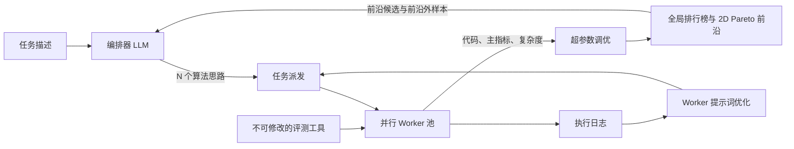

# 基于 LLM 的无线通信算法生成架构优化分析

## 1. 分析对象与结论

本文分析对象为仓库中的论文 [《Autonomous Discovery of Wireless Communications Algorithms》](../report.pdf) 及其当前 AITE（The AI Telco Engineer）实现。分析重点不是继续堆叠更强的 LLM，而是检查“想法生成 - 代码实现 - 仿真评测 - 候选选择 - 再搜索”这一闭环是否真正实现了可靠、样本高效的多目标算法发现。

核心结论如下：

1. **当前最重要的问题是全局目标与 Worker 局部目标不一致。** 全局排行榜声称联合优化性能与复杂度，但 Worker 提示词要求“获得最佳主指标”，`solution.py` 也只在主指标改善时保存。Worker 运行中出现的“性能略弱但时延显著更低”的候选可能在进入全局 Pareto 前沿前就被丢弃。
2. **评测工具是系统瓶颈，也是最主要的过拟合入口。** 当前任务主要以固定 SNR、固定随机种子和有限 Monte Carlo 预算产生点估计。搜索会逐渐适配这些具体样本、信道和硬件噪声，因此必须引入多保真评测、滚动种子、隐藏验证集和置信区间。
3. **按代同步、平均分配 Worker 的方式浪费计算预算。** 所有思路得到相同数量的 Worker，且必须等待整代完成后才能重分配资源；这既不能快速淘汰明显失败的思路，也不能及时加注有突破迹象的思路。
4. **当前“Pareto 前沿 + 按主指标抽样的前沿外候选”还不足以维持算法多样性。** 应把算法家族、结构特征和实现机制作为行为描述符，构建质量-多样性档案，并用预期超体积增益、创新度、成功概率和评测成本共同决定下一次实验。
5. **建议优先建设 AITE 2.0 的四个基础能力：** Worker 内局部 Pareto 档案、分层且带不确定性的评测服务、事件驱动的异步预算调度器、结构化候选/谱系/失败记忆。完成这些后，再做多模型路由、跨任务迁移和硬件在环。

论文已经证明该范式具备价值：OTFS 任务生成了 1890 个可运行候选和 1114 个不同架构，选定算法相对最强基线约快 3.6 倍；无导频 OFDM 任务生成了 1240 个可运行接收机，并发现了可解释的盲信道估计与多假设解调机制。不过，论文也报告单任务约需 4 天、16 张 GPU 和约 2500 美元 LLM 推理成本，且主要时间消耗在候选评测上。因此，下一阶段的关键指标应从“生成了多少候选”转向“每 GPU 小时带来多少可信的 Pareto 超体积增益”。

## 2. 当前架构复盘

AITE 采用双层架构：编排器负责生成思路、派发任务、总结结果和维护排行榜；多个 Worker 在隔离容器内运行 ReAct 编码代理，通过任务专用评测工具迭代 `draft.py`，框架将最佳版本保存为 `solution.py`，再用 Optuna 做多目标超参数调优。



现有设计中值得保留的部分包括：

- 任务描述与不可修改评测工具分离，降低直接篡改评分逻辑的风险。
- 每个 Worker 使用独立容器和工作区，减少相互污染并保护宿主机。
- 同一思路分配多个 Worker，利用 LLM 随机性降低“单次实现失败即误杀思路”的概率。
- 维护性能-复杂度 Pareto 前沿，而不是只返回单一最优点。
- 对代码是否遵循所分配思路做 `yes/partial/no` 后处理，避免错误归因。
- Worker 日志可以驱动提示词迭代，超参数调优可以为一个实现产生多个折中点。

这些机制构成了良好起点，但当前代码中仍存在下列闭环断点。

## 3. 主要瓶颈与代码证据

| 优先级 | 瓶颈 | 当前证据 | 直接后果 |
|---|---|---|---|
| P0 | Worker 内仍是单目标选择 | Worker 被要求“获得最佳主指标”见 [`src/agent.py`](../src/agent.py#L65)；自动保存只比较 `_best_metric`，见 [`src/tool_lib/base.py`](../src/tool_lib/base.py#L204) | 低时延、低显存但主指标略弱的实现无法进入全局 Pareto 档案 |
| P0 | 评测是固定点估计 | 无导频任务使用固定 `NVE_SEED = 42`，见 [`tasks/pilotless/eval/eval.py`](../tasks/pilotless/eval/eval.py#L99)；当前快速设置只有 100 次最大 MC 迭代，见同文件 [L87](../tasks/pilotless/eval/eval.py#L87) | 搜索可能过拟合随机流、SNR 网格、信道模型与测时噪声，候选排序不稳定 |
| P0 | 评测诊断信息未进入候选数据模型 | 解析器能读取额外 `info`，但保存的 `result.json` 只保留 metric 与 complexity，见 [`src/agent.py`](../src/agent.py#L403) 和 [`src/leaderboard.py`](../src/leaderboard.py#L50) | 编译告警、逐 SNR BLER、失败原因和不确定性不能参与调度与后续推理 |
| P0 | 超参数索引存在引用风险 | 调优后按 Pareto 顺序重新编号，见 [`src/tool_lib/hyperparameter_tuner.py`](../src/tool_lib/hyperparameter_tuner.py#L165)；但引用代码仅在 `hp_index != 0` 时烘焙参数，见 [`src/orchestrator/agent_orchestrator.py`](../src/orchestrator/agent_orchestrator.py#L543) | 第 0 个 Pareto 点若来自非默认参数，下一代 Worker 可能拿到与排行榜点不一致的代码 |
| P1 | 按代同步且平均分配预算 | 每个思路固定获得 `population_size // n` 个任务，见 [`src/orchestrator/agent_orchestrator.py`](../src/orchestrator/agent_orchestrator.py#L368)；整代等待所有结果，见同文件 [L413](../src/orchestrator/agent_orchestrator.py#L413) | 明显失败思路消耗完整预算，突破思路无法即时扩容，慢任务形成代际屏障 |
| P1 | 前沿外抽样只看主指标差距 | 抽样概率仅由归一化 metric gap 决定，见 [`src/leaderboard.py`](../src/leaderboard.py#L299) | 忽略复杂度、评测不确定性、算法新颖度、成功率和预计评测成本 |
| P1 | 上下文以原始代码为主，扩展性有限 | 每个候选最多截取前 200 行代码，见 [`src/orchestrator/orchestrator_llm.py`](../src/orchestrator/orchestrator_llm.py#L289) | 前沿增长后提示词膨胀；长代码尾部关键逻辑可能被截断；失败经验难以检索复用 |
| P1 | 超参数空间会无控制膨胀 | 提示词要求所有影响性能的数值或模式都使用 `HP.get`，见 [`src/agent.py`](../src/agent.py#L83) | 高维、条件相关的搜索空间使固定 30 次 Optuna 试验迅速失效，并重复消耗昂贵仿真 |
| P1 | 目标协议固定为两个标量 | 评测协议只支持 `SUCCESS, metric, complexity`，见 [`src/tool_lib/base.py`](../src/tool_lib/base.py#L96)；排行榜只计算二维前沿，见 [`src/leaderboard.py`](../src/leaderboard.py#L171) | 无法原生表达显存、能耗、尾时延、鲁棒性、LLR 校准、硬约束与多硬件目标 |
| P2 | 配置存在静默漂移 | 两个任务仍配置已不再读取的 `top_k_summaries` 与 `top_k_temperature`，例如 [`tasks/otfs_detector/config.json`](../tasks/otfs_detector/config.json#L39)；加载器不校验未知字段，见 [`src/config.py`](../src/config.py#L179) | 用户以为配置生效，实际被静默忽略，实验可复现性与调参可信度下降 |

其中第一项是最关键的结构性问题。当前系统只有在“不同 Worker 或 Optuna 参数点之间”实现多目标优化，却没有在“单个 Worker 的代码演化轨迹中”实现多目标保留。换言之，局部搜索的单目标瓶颈发生在全局 Pareto 计算之前。

## 4. 优化方案

### 4.1 将评测工具升级为多保真、带不确定性的评测服务

建议把当前字符串协议升级为结构化 `EvalResult`，同时保留旧首行协议用于兼容：

```json
{
  "status": "success",
  "fidelity": "screen|validation|audit|hardware",
  "objectives": {
    "nve": {"mean": 0.61, "stderr": 0.03},
    "latency_ms": {"p50": 2.1, "p95": 2.4},
    "peak_memory_mb": 380
  },
  "constraints": {"compiled_fullgraph": true, "nan_rate": 0.0},
  "scenario": {"channel": "TDL-C", "snr_db": [13, 16], "seed_set": "rolling-17"},
  "diagnostics": {"bler_by_snr": [0.08, 0.01], "compile_warnings": []},
  "cost": {"gpu_seconds": 21.4}
}
```

建立四级评测漏斗：

1. **F0 - 正确性与静态筛查：** 接口、形状、数值稳定性、复杂度上界、禁止项、`torch.compile` 图断裂、少量确定性样本。目标是以秒级成本淘汰错误实现。
2. **F1 - 快速仿真：** 小批量、多随机种子、较宽 SNR/信道覆盖，输出均值、方差和置信区间。只用于筛选，不用于最终声称。
3. **F2 - 完整验证：** 对预计能改善前沿的候选增加 MC 样本，使用滚动私有种子，并在未参与搜索的信道参数上复验。
4. **F3 - 审计与部署：** 对最终前沿在隐藏信道模型、多硬件、多个批大小和冷/热编译条件下测量，必要时接入硬件在环。

调度器应按统计证据逐级晋升候选，而不是让每个实现一开始就获得相同 MC 预算。Hyperband 的核心思想正是通过自适应资源分配和早停降低昂贵试验成本，可作为 F1 到 F2 晋升机制的基础：[Li et al., JMLR 2018](https://www.jmlr.org/beta/papers/v18/16-558.html)。

还应增加以下保护：

- 公共固定种子只用于调试；选择和晋升使用滚动私有种子，最终审计使用搜索过程不可见的隐藏种子。
- 对 BLER/NVE 给出置信区间；只有当候选的保守界仍有改善时才大规模加注。
- 时延至少保存中位数、P95、离散度、测时次数、硬件与软件栈；对频率变化、缓存和编译模式做隔离。
- 以 `code_hash + hyperparameters + evaluator_hash + environment_hash + scenario + seed` 为键缓存结果，避免重复编译和重复仿真。
- 使用快速评测与完整评测之间的秩相关性监控保真度；相关性下降时自动增加 F1 预算或调整场景。

### 4.2 在 Worker 内维护局部 Pareto 档案

将 `draft.py -> 单一 solution.py` 改为 `draft.py -> local_archive/`：

- 每次成功评测后，如果候选不被局部档案支配，则保存代码快照、参数、指标分布、代码哈希和父版本。
- 如果两个候选在置信区间内不可区分，优先保留更简单、编译更完整或实现差异更大的版本。
- Worker 结束时返回多个局部精英，而不是只返回一个主指标最优实现；全局排行榜再合并去重。
- 给同一思路下的不同 Worker 分配不同偏好，例如“时延不超过 2 ms 时最小化 NVE”“NVE 不超过 0.7 时最小化显存”或不同参考向量，以主动覆盖前沿。
- 超参数调优只对局部档案中有希望的少量代码版本执行，而不是对单一最终版本盲目进行固定次数调优。

这一改动能够直接修复当前最严重的目标错配，并可复用现有 `HPResult` 与全局 Pareto 逻辑。实现时还应给超参数配置分配稳定 ID 或内容哈希，不再假定 `hp_index == 0` 一定代表源码默认值。

### 4.3 用异步、成本感知的调度替代固定代际屏障

建议把“每代 N 个思路、每个思路固定 M/N 个 Worker”改为事件驱动队列：

1. 新思路先获得一个小预算 Worker 和 F1 评测。
2. 每产生一个结果，立即更新档案和调度分数，无需等待整代最慢任务。
3. 有改善概率的思路被追加 Worker、提高评测保真度或交给更强模型；明显失败或高度重复的思路暂停。
4. 周期性保留一部分硬预算用于全新算法家族，防止调度器只围绕当前前沿贪心收缩。

可使用如下成本感知采集分数作为起点：

\[
\text{score}(i)=
\frac{\mathbb{E}[\Delta HV_i]\,P(\text{feasible}_i)\,(1+\lambda_n\,\text{novelty}_i)}
{\mathbb{E}[\text{GPU-seconds}_i]+\lambda_c\,\mathbb{E}[\text{LLM-cost}_i]}.
\]

其中 `ΔHV` 是预计 Pareto 超体积改善，`novelty` 衡量机制或代码结构新颖度。通信仿真的观测天然有噪声，可参考对噪声和并行批量评测建模的 qNEHVI：[Daulton et al., NeurIPS 2021](https://proceedings.neurips.cc/paper/2021/hash/11704817e347269b7254e744b5e22dac-Abstract.html)。这里不要求直接对代码空间拟合一个精确高斯过程；可以先按算法家族、父候选特征和历史结果建立轻量成功率/成本模型，再逐步升级。

同时修正任务数分配：精确使用 `population_size`，把除法余数分给得分最高或不确定性最大的思路；当 `population_size < num_ideas` 时不应反向超发任务。

### 4.4 从普通 Pareto 排行榜升级为质量-多样性档案

仅维护全局二维前沿容易让一种成功家族占满上下文。建议为每个候选提取行为描述符，例如：

- 算法家族：LMMSE、EP/EC、AMP、消息传递、列表搜索、决策导向、神经/非神经混合等。
- 结构利用：稀疏图、块循环、FFT 对角化、低秩、局部平滑、跨 RE 关系。
- 计算形态：迭代次数、矩阵分解类型、稀疏度、并行度、显存访问模式、是否完整编译。
- 鲁棒性维度：适用调制阶数、SNR 区间、信道模型、CSI 假设、MIMO 可扩展性。

使用代码 AST 指纹、调用图、执行轨迹和语义摘要联合生成描述符；在描述符空间中建立 MAP-Elites 风格网格，每个格子内部再维护带不确定性的 Pareto 前沿。MAP-Elites 的目标是保留“行为不同但各自高质量”的精英，而不是只追逐一个全局最优点：[Mouret and Clune, 2015](https://arxiv.org/abs/1504.04909)。

具体改动包括：

- 在生成新思路前做语义与结构去重，拒绝只是改名或轻微参数变化的候选。
- 前沿外抽样同时考虑超体积潜力、创新度、历史实现成功率和成本，不再只看主指标差距。
- 保留失败档案，记录失败类型、错误堆栈、适用前提和已验证的反例；生成思路时检索相关失败，避免跨代重复踩坑。
- 维护显式谱系图：父代码、差分、引用参数点、提出的机制、实际实现机制和评测场景均可追溯。

### 4.5 结构化编排器输出与分层上下文

当前思路主要是一段自然语言描述。建议改为结构化 `IdeaSpec`：

```json
{
  "family": "block-FFT expectation consistency",
  "parent_refs": ["gen08-0042:cfg-a13"],
  "hypothesis": "共享每个 delay 的精度可降低求解成本且不明显损害 LLR",
  "mechanism": ["Doppler DFT 解耦", "Cholesky solve", "两次 EC 迭代"],
  "expected_effect": {"nve": "flat_or_better", "latency": "decrease"},
  "constraints": {"latency_ms_max": 3.0},
  "prerequisites": ["block-circulant channel view"],
  "falsification_test": "F1 下 NVE 的 95% 上界必须低于 0.75",
  "novelty_signature": ["shared_precision", "partial_third_iteration"],
  "estimated_cost": "medium"
}
```

编排过程可拆成三个可审计步骤：

1. **提出者：** 生成新机制、改进、组合和简化方案。
2. **批评者：** 检查物理可行性、信息可用性、是否重复、预期复杂度和可证伪性。
3. **分配器：** 基于档案、预算和不确定性决定用哪个模型、多少 Worker、何种保真度。

上下文不应把所有前沿代码平铺进提示词，而应采用分层检索：

- 永远提供任务契约、当前前沿摘要和预算。
- 对直接父候选提供完整代码或精确 diff。
- 对相邻算法家族提供结构化摘要、关键函数和行为描述符。
- 对失败经验只提供与当前前提匹配的条目。
- 为每次调用设置明确 token 预算，记录被截断或省略的内容，避免“前 200 行”静默丢失关键尾部逻辑。

多模型路由也应放在分配器中：快速、低成本模型负责广度和简单变体；强模型负责高价值思路的物理推理、复杂实现与审查。AlphaEvolve 公开说明其使用快速模型扩大搜索广度、强模型提供深度，这一思路适合迁移到 AITE 的成本控制中：[Google DeepMind, 2025](https://deepmind.google/blog/alphaevolve-a-gemini-powered-coding-agent-for-designing-advanced-algorithms/)。

### 4.6 重构超参数优化

论文已经指出贝叶斯优化在几十个超参数时会变得不实用，而当前提示词又要求几乎所有常量都成为可调参数。建议：

- 只暴露对假设有直接因果关系的 3-8 个高优先级参数；其余常量保留物理默认值。
- 支持条件搜索空间，例如仅当 `refinement="bp"` 时启用 BP 相关参数。
- 沿谱系共享 Optuna study，用父候选的敏感度和优良参数热启动子候选。
- 先做低保真敏感度筛查，冻结不敏感参数，再为高价值候选执行完整多目标调优。
- 可微连续参数使用梯度或隐式微分；迭代次数、算法模式等离散变量单独使用贝叶斯/进化方法。
- 将“结构搜索预算”和“参数调优预算”显式分开，并根据最近单位成本超体积增益动态调整，而不是每个 Worker 固定 30 次试验。

### 4.7 增加无线通信专用的鲁棒性与部署目标

从“在一个模拟器、两处 SNR、一个硬件上取得低 NVE/时延”扩展到“可部署且可解释的算法”，至少应覆盖：

- **泛化：** 不同 TDL/CDL 信道、时延扩展、多普勒、SNR、调制阶数、码率、天线数、CSI 误差和硬件量化。
- **可靠性：** 平均 BLER/NVE、最坏场景或 CVaR、LLR 校准误差、数值溢出率和收敛失败率。
- **复杂度：** FLOPs、显存、内存带宽、编译时间、P50/P95 时延、吞吐、能耗以及 CPU/GPU/DSP/FPGA 的可映射性。
- **物理性质测试：** 相位/尺度变化、资源元素置换、噪声极限、零信道/强信道边界和已知简化场景中的一致性。
- **可解释性：** 自动生成假设、推导、伪代码、复杂度分析、适用条件和反例；通过独立测试验证，而不是仅依赖 LLM 自述。

最终 Pareto 档案可以是 N 维的，但用户界面不必展示所有维度。可先按硬约束过滤，再显示性能-时延二维切片，并允许切换硬件和鲁棒性场景。

### 4.8 工程治理、复现与安全

- 使用严格配置 schema，未知字段直接报错或至少发出高可见度警告，消除静默配置漂移。
- 每次运行保存 manifest：Git commit、所有提示词哈希、模型/端点/采样参数、容器镜像 digest、评测器哈希、数据版本、随机种子、GPU 型号、驱动和依赖版本。
- 记录每次 LLM 调用的 token、费用、延迟和失败重试；记录每次仿真的 GPU 秒，从而计算真实发现成本。
- 对评测工具、基线文件和隐藏验证集做只读挂载与哈希校验；候选输出采用内容寻址，避免工作区 ID 与实际代码不一致。
- 为 Pareto 去重、置信支配、超参数烘焙、断点恢复、未知配置、异步调度和缓存键增加单元/属性测试。
- 提示词自动优化应经过离线日志回放或小流量 A/B 验证后再全局启用，防止一次错误总结污染后续所有 Worker。

## 5. 建议的 AITE 2.0 架构


建议的数据流是：候选先在 Worker 内形成局部 Pareto 快照；评测服务返回分布而非单点；档案做置信支配、去重和质量-多样性更新；异步调度器根据预计超体积增益/成本决定下一次 LLM 调用或仿真；只有通过隐藏验证的候选才进入“已验证前沿”。

## 6. 分阶段落地顺序

### P0：先修复闭环正确性

| 改动 | 主要文件 | 验收条件 |
|---|---|---|
| Worker 局部 Pareto 保存，不再只按主指标覆盖 `solution.py` | `src/tool_lib/base.py`、`src/agent.py`、`src/orchestrator/workspace_io.py` | 构造两个互不支配版本时，两者都能进入全局档案 |
| 修复超参数点稳定标识与参数烘焙 | `src/tool_lib/hyperparameter_tuner.py`、`src/orchestrator/agent_orchestrator.py` | 任意 Pareto 点作为父代时，实际代码默认值与排行榜参数完全一致 |
| 结构化保存评测诊断和成本 | `src/agent.py`、`src/leaderboard.py`、两个任务的 `eval.py` | 排行榜可追溯逐 SNR 结果、种子、编译状态和 GPU 秒 |
| 配置严格校验 | `src/config.py`、任务 `config.json` | 未知字段导致明确失败；现有任务无废弃键 |
| 固定种子仅用于调试，增加滚动/隐藏验证 | 两个任务的 `eval/eval.py` | 同一前沿候选在多种子复验中给出置信区间和排名稳定性 |

### P1：提高单位计算预算的发现效率

| 改动 | 主要文件 | 验收条件 |
|---|---|---|
| F0-F3 多保真评测与内容寻址缓存 | 评测工具基类、任务评测脚本 | 重复候选不重复仿真；明显失败候选不进入完整 MC |
| 异步调度与分阶段晋升 | `src/orchestrator/agent_orchestrator.py`、`worker_pool.py` | 无整代屏障；空闲 GPU 能立即接收新任务 |
| 成本感知、多目标候选选择 | `src/leaderboard.py`、新 scheduler 模块 | 同等 GPU 小时下，验证前沿超体积优于基线 |
| 结构化 IdeaSpec 与上下文检索 | `src/orchestrator/orchestrator_llm.py` | 新思路可追踪假设、父代、约束、反证测试；提示词长度有硬预算 |
| 稀疏、条件、热启动的超参数优化 | `src/tool_lib/hyperparameter_tuner.py` | 单位调优试验带来的超体积增益提高，重复试验减少 |

### P2：扩大探索范围与部署价值

- 质量-多样性档案、代码结构去重和失败记忆。
- 快速/强模型路由与按价值分配推理预算。
- 跨任务机制库，例如“块循环 FFT 解耦”“多假设边缘化”“决策导向虚拟导频”等可验证组件。
- 多硬件 Pareto、自动 CUDA/Triton 内核优化、DSP/FPGA 约束和硬件在环。
- 人类研究员审批高成本 F3 评测、修改任务契约或将候选提升为可发布结果。

## 7. 验证优化是否有效

应在相同总 GPU 小时、相同 LLM 美元预算和相同隐藏测试集下，对 OTFS 与无导频任务做消融，而不是比较生成候选总数。建议至少运行：

1. `B0`：当前实现。
2. `B1`：仅加入 Worker 局部 Pareto 与稳定超参数 ID。
3. `B2`：`B1` + 多保真评测、滚动种子和缓存。
4. `B3`：`B2` + 异步成本感知调度。
5. `B4`：`B3` + 质量-多样性档案与结构化上下文。

关键指标：

- **搜索效率：** 验证前沿超体积/GPU 小时、达到目标 NVE-时延区域的时间、每次有效前沿更新的 LLM 成本。
- **评测可信度：** F1 与 F2 排名相关性、公开评测前沿在隐藏评测中的存活率、多次独立搜索所得前沿的重叠度。
- **多样性：** 有效算法家族数、行为格覆盖率、代码/机制重复率、前沿被单一家族占据的比例。
- **系统效率：** GPU 利用率、调度等待时间、慢任务占比、缓存命中率、失败候选平均消耗。
- **Worker 质量：** 可运行率、思路遵循率、首次成功所需评测次数、局部 Pareto 点数、完整编译率。
- **部署性：** 跨信道/跨硬件前沿存活率、P95 时延、峰值显存、能耗与 LLR 校准。

建议的阶段门槛可以包括：快速/完整评测的 Spearman 相关系数达到 0.8 以上、隐藏评测前沿存活率达到 80% 以上、GPU 利用率达到 85% 以上，并在同等总成本下取得显著的验证超体积增益。这些数值是工程验收起点，不是对当前系统结果的实测结论，应通过首轮基线实验校准。

## 8. 最优先的五项行动

如果只能按顺序做五项改动，建议如下：

1. **将 `solution.py` 单点保存改为 Worker 内局部 Pareto 档案，并修复超参数点 0 的烘焙风险。**
2. **让评测结果携带场景、种子、置信区间、诊断和 GPU 成本；加入滚动种子及隐藏复验。**
3. **建立 F0-F3 多保真评测、缓存和早停，减少完整 Monte Carlo 次数。**
4. **把固定代际平均派发改成异步、按预期超体积增益/成本分配的调度。**
5. **建设质量-多样性档案、谱系和失败记忆，再对编排器做结构化思路生成与多模型路由。**

这一路径优先修复“候选是否被正确保留”和“分数是否可信”两个基础问题。只有这两个问题得到解决，更强 LLM、更多 GPU 或更复杂的提示词优化才会稳定转化为更好的无线通信算法，而不是更快地过拟合评测工具。

## 9. 参考资料

- Faycal Ait Aoudia et al., [Autonomous Discovery of Wireless Communications Algorithms](../report.pdf), 2026。
- Lisha Li et al., [Hyperband: A Novel Bandit-Based Approach to Hyperparameter Optimization](https://www.jmlr.org/beta/papers/v18/16-558.html), JMLR, 2018。
- Samuel Daulton, Maximilian Balandat, Eytan Bakshy, [Parallel Bayesian Optimization of Multiple Noisy Objectives with Expected Hypervolume Improvement](https://proceedings.neurips.cc/paper/2021/hash/11704817e347269b7254e744b5e22dac-Abstract.html), NeurIPS, 2021。
- Jean-Baptiste Mouret, Jeff Clune, [Illuminating Search Spaces by Mapping Elites](https://arxiv.org/abs/1504.04909), 2015。
- Google DeepMind, [AlphaEvolve: A Gemini-powered coding agent for designing advanced algorithms](https://deepmind.google/blog/alphaevolve-a-gemini-powered-coding-agent-for-designing-advanced-algorithms/), 2025。

> 说明：论文中的性能与成本数字属于原报告结果；本文对预期收益、优先级和验收门槛的描述属于基于报告、当前代码与相关原始研究作出的工程判断，尚未通过新的完整 AITE 搜索实测。
